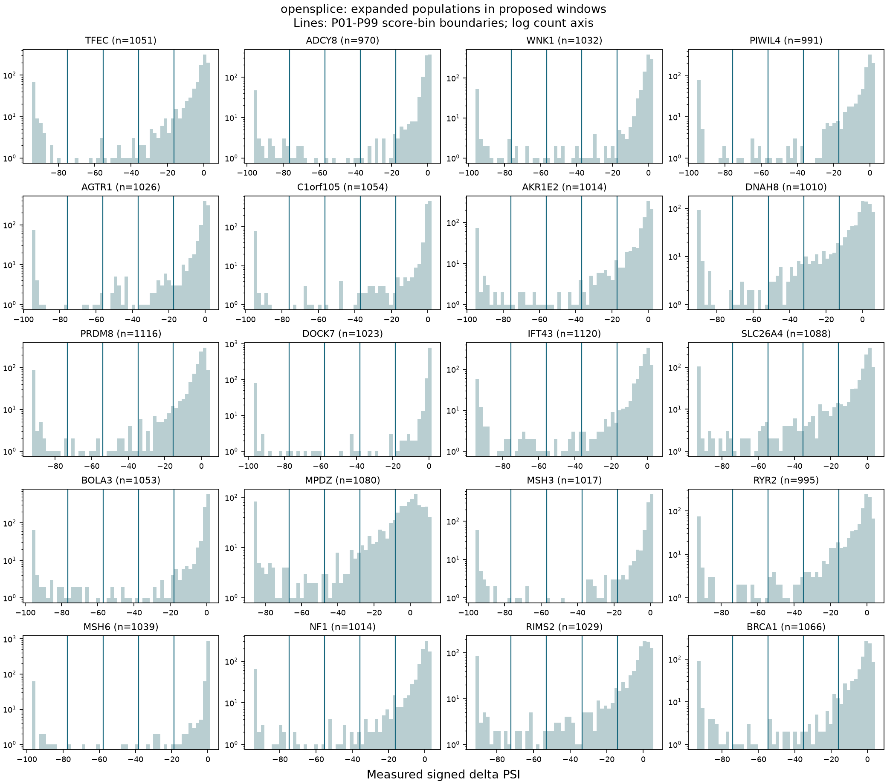
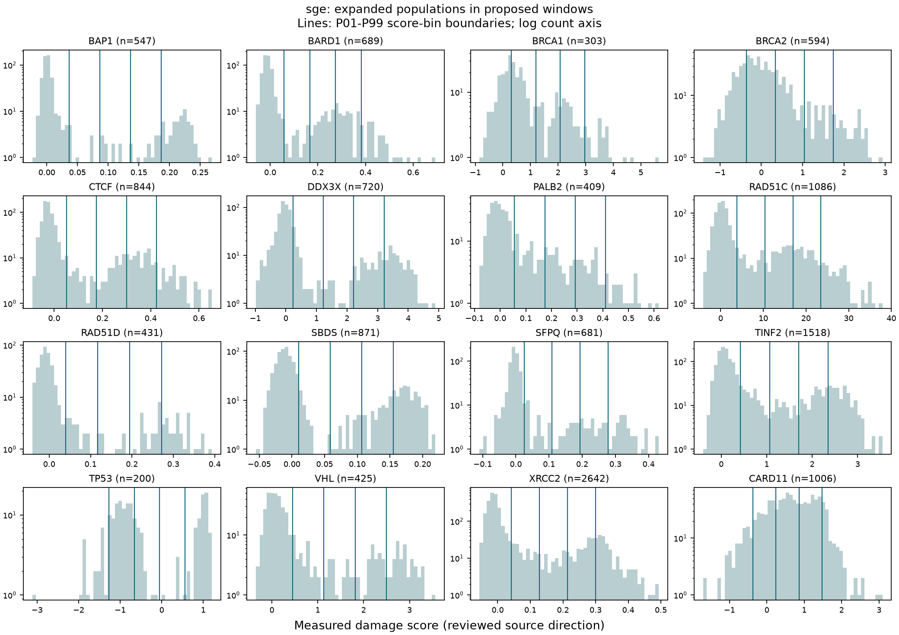
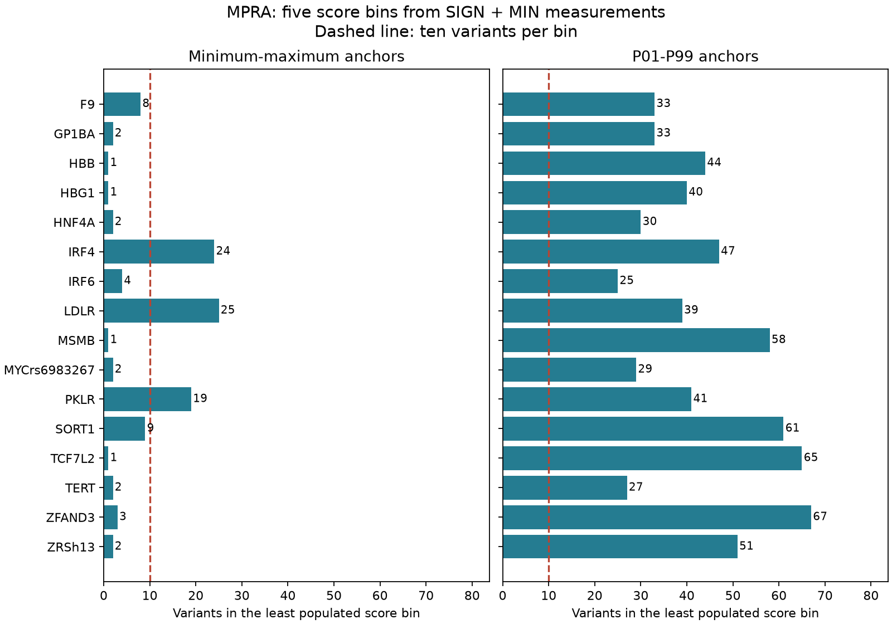
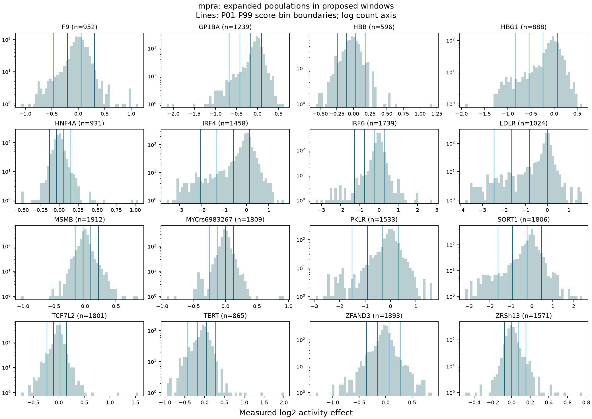

# Task sampling analysis: 2026-09-04

This report completes the primary-population comparison for
[issue #62](https://github.com/Open-Athena/VEP-bench/issues/62). Production
sources and question sets have not yet been regenerated. The user authorized
SkyPilot compute, approved MPRA `SIGN + MIN` with `QUAL` excluded, and
confirmed that both OpenSplice and SGE windows must be reconsidered. SGE has
no SNV preference, consequence filter, or consequence quota in this audit.

## Recommended construction policy

Use five bins with equally spaced internal boundaries between each eligible
window's P01 and P99 scores. Keep the tails in the outer bins and keep the
original signed labels. Target ten distinct variants per bin, take all
variants in underfilled bins, and redistribute unused slots evenly subject
to capacity. Break allocation remainders by ascending bin index. This yields
50 candidates without selecting windows merely for their distribution shape.

Recompute window selection from the expanded populations: maximize P95-P05
within each gene, then eligible count, then ascending window coordinates or
exon identity. For OpenSplice, rank the gene winners by descending P95-P05,
descending eligible count, ascending gene and exon ID, and retain 20 distinct
genes. For SGE, retain one window per reviewed gene without any consequence
or allele-type preference. Include the reviewed CARD11 baseline assay,
bringing SGE to 16 questions. These are implementation recommendations from
the audit; production behavior is still the historical behavior.

| Expanded population / windows | Minimum–maximum bins: exact 5 × 10 | P01–P99 bins: exact 5 × 10 |
| --- | ---: | ---: |
| MPRA: all 16 elements, SIGN + MIN | 3 / 16 | 16 / 16 |
| SGE: historical 15 windows | 10 / 15 | 15 / 15 |
| SGE: reselected 16 windows, including CARD11 | 9 / 16 | 13 / 16 |
| OpenSplice: historical 20 windows | 19 / 20 | 19 / 20 |
| OpenSplice: reselected 20 windows | 7 / 20 | 7 / 20 |

Reselection replaces 18 of 20 OpenSplice windows and 6 of the original 15 SGE
windows. It is evaluated separately from changing the sampler. In particular,
the good bin occupancy of the historical OpenSplice windows does not describe
the reselected population. Its strongest P95-P05 windows are often bimodal,
with sparse intermediate effects. Requiring exactly ten per bin would favor
different distribution shapes and is not recommended as an implicit filter.

All 52 proposed questions can supply 50 unique candidates using the flexible
allocation. The three sparse SGE windows are BAP1, RAD51D and TP53. A sparse
OpenSplice example, MSH6 (`ENSE00003677325`), has robust-bin populations
`[70, 3, 2, 7, 957]`, producing allocations `[19, 3, 2, 7, 19]`.
None of the proposed windows has collapsed anchors. One otherwise measured
OpenSplice exon (`ENSE00001304923`) has only 35 eligible alleles and is
ineligible for a 50-candidate question; no sampling fallback is applied.

## Inputs, validation and exclusions

Every primary payload was checked against its byte count and SHA-256 pin.
Existing pins live in each task's `config/source-pins.yaml`. Supplemental
CARD11 identities and assay settings are in
[task_sampling_audit_inputs.json](../../scripts/task_sampling_audit_inputs.json).
The audit never downloads SGE VEP consequences or the nearest-exon GTF.

### OpenSplice

The pinned Figshare v5 master contains 590,104 measured rows. The audit
excludes 11,097 rows without usable exon metadata and 396 with nonfinite
primary measurements or replicates. It retains 578,611 unique assayed
constructs, including the same 300,327 SNVs recovered by the historical
eligibility logic and 278,284 deletions:

| Allele type | Eligible measurements |
| --- | ---: |
| SNV | 300,327 |
| 1-nt deletion | 70,433 |
| 3-nt deletion | 71,177 |
| 6-nt deletion | 69,973 |
| 21-nt deletion | 66,701 |

Deposited RNA bases are converted to DNA. Deletion markers such as `∆6nt`
must agree with the declared length and mutation type. Every retained row
passes complete REF-span checking and exact reconstruction of the deposited
mutant cassette. Distinct deposited records cannot silently duplicate the
same mutant construct. Predictor availability is not an eligibility gate.

There are 587 measured exon populations, of which 586 have at least 50
eligible alleles, spanning 458 genes. Across those 586 windows, 433 support
exact five-by-ten sampling with robust anchors, versus 400 with min/max.
After reselection, the proposed 1,000-candidate panels contain 422 SNVs and
578 deletions; 252 candidates are 21-nt deletions. This composition results
from score sampling, without allele-type quotas.



### SGE and CARD11

The original 15 score sets yield 114,992 distinct normalized alleles before
window selection. Every finite source allele maps and passes full genomic
REF validation. Ten source rows belong to duplicated normalized alleles
(two DDX3X rows and eight RAD51C rows); all rows for those duplicated
identities are excluded rather than selecting a measurement arbitrarily.
There are no other mapping exclusions in these pinned score sets.

The mapper supports substitutions, deletions, insertions, multibase
replacements and duplications, including both transcript orientations.
It preserves TINF2 target/CDS identity validation, the reviewed transcript
choices, score directions and experimental QC settings. The entire
normalized REF span must fit the exon plus exactly 100 genomic bases on
each side. Adjacent exon windows may overlap, so summed per-window counts
must not be interpreted as distinct gene-wide counts.

CARD11's earlier exclusion depended on its predominantly multibase library.
The reviewed baseline assay is
[MaveDB urn:mavedb:00001226-a-1](https://api.mavedb.org/api/v1/score-sets/urn%3Amavedb%3A00001226-a-1),
which deposits endogenous diploid SGE in TMD8 cells, without the ibrutinib
selection used in the separate gain-of-function assay. Its declared target
is `ENST00000396946.9`. The pinned methods define lower normalized log2
abundance scores as loss of function, so the damage direction is -1.
The other CARD11 deposits are not counted as independent questions.

All 3,844 CARD11 rows map; two rows share a normalized allele identity,
leaving 3,842 eligible alleles. The reselected exon window has 1,006 variants:
210 SNVs, 288 two-base replacements, and 508 three-base replacements. Its
robust bins support ten candidates each. This supports adding CARD11 as a
sixteenth SGE question, subject to the same production display validation
as every other gene.

Together the 16 genes supply 118,834 unique alleles and 142 nonempty exon
windows. All 142 can supply 50 variants; robust bins support exact five-by-ten
in 114 windows, versus 63 using min/max. The proposed 800-candidate panels
contain 487 SNVs, 179 deletions, 17 insertions and 117 multibase replacements.



### MPRA

All 16 pinned CADD v1.7 RegSeq VCFs pass the existing parser. The pinned
headers define `MIN` as at least ten supporting barcodes and `SIGN` as that
support plus the significance threshold. `SIGN + MIN` supplies 22,017
measurements, compared with 4,332 under `SIGN` alone; 1,499 `QUAL` rows remain
excluded. These are experimental QC categories, not consequences.

Robust anchors allow exact five-by-ten in all 16 expanded elements, compared
with 8/16 for SIGN alone. Min/max allows it in 3/16 under either eligibility
policy. The least populated robust bin contains 25–67 variants. Expanded
panels contain 735 SNVs and 65 one-base deletions. The historical CADD file
label `GP1BA` refers to the GP1BB promoter.

This audit reuses the historical crosswalk/reference provenance; it does not
rerun the MPRA MaveDB crosswalk. Production preparation must still validate
all selected alleles against their reporter constructs. The exact pinned
ZRS exception remains an excluded QUAL record.





## Interpretation and limitations

These comparisons use full primary populations and a ten-quantile/five-per-bin
baseline on the same expanded population. They do not compare a new sampler
against the old, differently filtered 50-candidate panel. Individual selected
score ranges, P95-P05 spreads and allele-type counts are recorded for every
policy. Broader sampling changes allele-type composition as well as effect
magnitudes; there is no promise of uniform variant types or preservation of
the empirical assay distribution.

P01/P99 anchors reduce the influence of isolated extremes on the internal
boundaries. They do not remove tails, change scores, or certify the
reliability of an extreme measurement. The audit preserves MPRA barcode and
p-value fields and the three OpenSplice replicates in the worker's compact
population file. Finiteness and source QC are the checks used here; no new
uncertainty threshold or statistical framework has been introduced.

Large deletions can produce readily distinguishable severe effects. Broader
effect separation can improve a correlation without improving ordering
within effect groups. Preserve Spearman as primary, Pearson and valid-output
rate as secondary, and keep historical results attached to their original
question-set digests. Do not interpret a changed panel's score as a directly
comparable model improvement.

## Reproducibility and artifacts

The [occupancy table](task-sampling-2026-09-04/occupancy.tsv) covers every
analyzed window and both eligibility pools. The
[feasibility table](task-sampling-2026-09-04/feasibility.tsv) distinguishes
all windows, current windows and reselected windows. Exact reselected keys
and tie-breaking are in
[window-selection.json](task-sampling-2026-09-04/window-selection.json).
The [compressed JSON summary](task-sampling-2026-09-04/summary.json.gz) contains
input pins, code digests, exclusions, score quantiles, boundaries, allocations
and selected/eligible allele-type counts for all policies and populations.
Gzip timestamps are fixed for deterministic output. Histograms use the full
native signed score axis and a logarithmic count axis.

The shared sampler uses seed `2026090400`, type-7 percentile interpolation,
cutpoints `L + k*(U-L)/5` for k = 1, 2, 3, 4, and right-bin assignment on
cutpoint equality. Values beyond the anchors remain in the outer bins.
Equal scores are never split to fill quotas. Selection hashes the seed,
question/window identity, bin and allele key. Collapsed anchors or fewer
than 50 unique alleles are explicit errors with no quantile fallback.

Install and run on a suitably sized worker:

```bash
uv sync --locked --all-packages --all-extras --group test --group quality --group analysis
uv run --locked python scripts/analyze_task_sampling.py \
  --inputs inputs --output analysis --tasks satmut-mpra opensplice sge --download
uv run --locked --group analysis python scripts/render_sampling_audit.py \
  --analysis analysis --output figures
```

The SkyPilot configuration requests 8+ CPUs and 32+ GB, lets SkyPilot choose
the cloud and region, and keeps inputs outside the synced workdir:

```bash
sky launch --dryrun sky/analyze_task_sampling.yaml
sky launch -c vepbench-issue62-audit sky/analyze_task_sampling.yaml \
  --detach-run --idle-minutes-to-autostop 30
sky logs vepbench-issue62-audit
scp -r vepbench-issue62-audit:~/issue62-analysis/figures ./figures
sky down --yes vepbench-issue62-audit
```

This audit ran on an AWS m6i.2xlarge (8 vCPU, 32 GiB), selected by SkyPilot at
approximately $0.38/hour before storage. The first successful 15-gene run,
including reference download, took 5:03.70 and peaked at 181,136 KiB RSS.
The complete cached-input run including CARD11 took 1:06.54 and peaked at
180,740 KiB. All inputs passed pins. No model API calls or official cache or
version uploads were made.

The local API server was stopped after exceeding the shared-node budget.
Provisioning used the installed SkyPilot 0.13.0 synchronous execution engine
under the nonblocking heavy-work lock instead; it peaked at 269,884 KiB.
The audit itself ran on the cloud worker. The root results ignore pattern
was anchored so SkyPilot also transfers the tracked synthetic test fixture.
The full offline suite passed on the worker (222 tests); Ruff and mypy also
passed. Offline reconstruction tests cover both orientations and all four
OpenSplice deletion lengths; selection tests cover changing windows while
retaining distinct genes and deterministic ties.

## Implementation handoff

Port the validated adapters and shared sampler into production preparation.
Remove SGE consequence/GTF dependencies, old class fields and allocation
logic, and SNV assumptions in mapping, display and validators. Rebuild the
expanded processed caches with new identities, retain all source QC and
complete-allele validation, and record sampling provenance. Recompute
windows from the expanded pool and include CARD11's reviewed baseline.
Update the three methodologies, prompts, human-facing OpenSplice naming,
cache versions and question-set versions together. Preserve historical
identifiers and results; changing the human-facing name does not require
rewriting the historical `opensplice_snv` family identifier.

Regenerate sources, manifests and expected question fingerprints through the
generators, then validate complete displayed REF spans and reconstructed
mutants on both orientations. The audit's genomic SGE mapping and construct
OpenSplice checks are evidence for the adapters; they do not substitute for
production VCF display validation and cache round trips.
