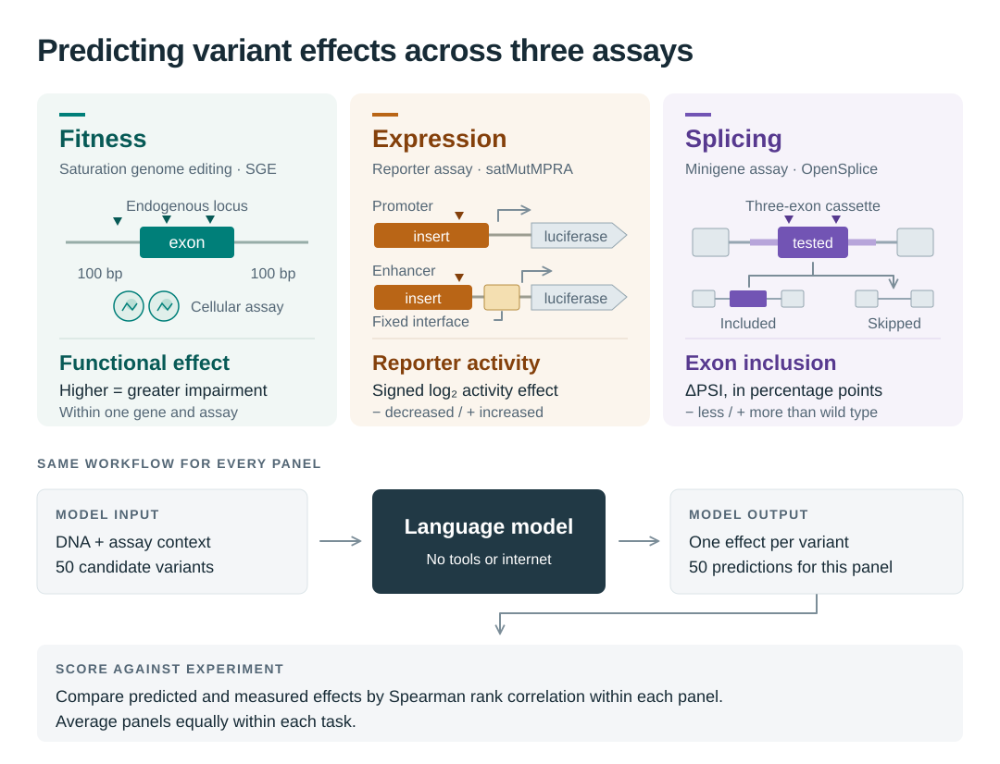

# Introducing VEP-bench: predicting variant effects with language models

VEP-bench v0.1

**Draft — dataset composition, model performance, and external comparisons.**

Can general-purpose language models predict the effects of genetic variants
from DNA sequence and experimental context? VEP-bench tests this directly,
without tools or internet access.

The first release covers fitness, gene expression, and splicing across 52
experimental panels and 2,600 variant appearances. Performance varies across
these tasks, providing a view of model capabilities that an overall score
alone cannot capture.

## Dataset

### Prediction tasks and questions

The three tasks measure different outcomes: functional effects in
[saturation genome editing (SGE)](../tasks/sge.html), reporter activity in
[satMutMPRA](../tasks/satmut-mpra.html), and exon inclusion in
[OpenSplice](../tasks/opensplice-snv.html).

Each question supplies sequence and assay context for a panel of 50 variants.
Models predict an effect for every variant. We score the predicted ordering
against the measurements using Spearman correlation within each panel, then
average panels equally within each task. The overall score is the equally
weighted mean of the three task scores.

<figure style="max-width: 1080px;">
  
  <figcaption>Each question is one panel from one assay. The biological target changes across tasks; the prediction and scoring workflow is shared. <a href="./introducing-vep-bench/tasks-overview.svg" download>Download the SVG</a> for a closer look.</figcaption>
</figure>

### Example prompt: MSH6 exon 7

This is the complete prompt for **MSH6 exon 7**, the panel selected for our
later response case study. The gene name identifies the example for readers;
it is not included in the model's prompt.

[Explore this question and model responses](../tasks/opensplice-snv.html?question=opensplice-snv-ranking-v2:E01).

```js
import MarkdownIt from "npm:markdown-it@14.1.0";
const examplePrompt = await FileAttachment("./introducing-vep-bench/msh6-e7-prompt.txt").text();
const examplePromptCard = document.createElement("div");
examplePromptCard.className = "card vepbench-record-content";
examplePromptCard.setAttribute("aria-label", "Complete example prompt for MSH6 exon 7");
examplePromptCard.innerHTML = new MarkdownIt({html: false}).render(examplePrompt);
display(examplePromptCard);
```

### Dataset composition

```js
import {variantComposition, compositionCsv} from "./introducing-vep-bench/analysis.js";
import {distributionFigure} from "./introducing-vep-bench/plots.js";

const metadata = await FileAttachment("../data/question-metadata.json").json();
const composition = variantComposition(metadata);
const complete = composition.tasks.every((task) => task.available);
const percent = (value) => `${(value * 100).toFixed(1)}%`;
const integer = (value) => value.toLocaleString("en-US");
function share(family, dimension, category) {
  const row = composition.rows.find((row) => row.task_family === family
    && row.dimension === dimension && row.category === category);
  return row ? `${percent(row.proportion)} (${integer(row.count)}/${integer(row.total)})` : "unavailable";
}
```

Counts describe the selected benchmark panels. Each variant is counted once
per panel; an allele appearing in two panels contributes twice.

```js
display(Inputs.table(composition.tasks.map((task) => ({
  Task: task.label,
  Panels: task.panels,
  "Selected variants": task.available ? task.total : null
})), {select: false, rows: 3}));
if (!complete) {
  display(html`<div class="warning" label="Incomplete snapshot">Variant metadata is missing for one or more tasks. The comparisons below are unavailable.</div>`);
}
```

<details id="snvs-indels-and-multibase-substitutions">
<summary>Variant type distribution</summary>

We classify the complete REF-to-ALT edit after trimming shared flanking bases.
An **SNV** substitutes one base; an **indel** changes sequence length, including
unequal-length replacements; a **multibase substitution** replaces multiple
bases without changing length. Each variant belongs to one category.

```js
if (complete) display(resize((width) => distributionFigure(composition, "type", width)));
```

Each task panel has its own automatically scaled percentage axis; compare the
percentage labels across tasks. Hover over a bar for its count and denominator;
zero labels indicate absent categories. On narrow screens, scroll horizontally
to compare all three tasks.

```js
if (complete) display(html`<p>
  Expression is predominantly SNVs: ${share("satmut_mpra", "type", "SNV")}.
  Splicing has a majority of indels: ${share("opensplice_snv", "type", "Indel")}.
  Fitness includes SNVs, indels, and a substantial multibase-substitution component:
  ${share("sge", "type", "Multibase substitution")}.
  The OpenSplice task therefore covers more than the SNVs suggested by its historical
  <code>opensplice_snv</code> identifier.
</p>`);
```

</details>

<details id="genomic-consequences">
<summary>Genomic consequence distribution</summary>

For each complete allele, we use the saved Ensembl VEP
`most_severe_consequence`: one highest-priority category per allele across the
returned transcript and regulatory-feature annotations. Transcript consequences
can differ between transcripts. The retained category is not an experimental
measurement or a clinical interpretation.
See Ensembl's [consequence definitions and severity ordering](https://www.ensembl.org/info/genome/variation/prediction/predicted_data.html).

```js
if (metadata.variant_annotation) display(html`<p class="muted">
  Annotation snapshot: ${metadata.variant_annotation.provider}, release ${metadata.variant_annotation.software.release};
  ${metadata.variant_annotation.assembly}; ${metadata.variant_annotation.transcripts};
  upstream/downstream distance ${integer(metadata.variant_annotation.parameters.distance)} bp.
</p>`);
if (complete) display(resize((width) => distributionFigure(composition, "consequence", width)));
```

Consequence rows are alphabetical and aligned across the three tasks. All
observed categories are retained, including rare consequences.

```js
if (complete && metadata.variant_annotation) display(html`<p>
  Missense variants are the largest category in fitness (${share("sge", "consequence", "missense_variant")}).
  Expression spans several genomic contexts, including intronic
  (${share("satmut_mpra", "consequence", "intron_variant")}) and upstream-gene
  (${share("satmut_mpra", "consequence", "upstream_gene_variant")}) annotations.
  Splicing includes splice-region, splice-site, coding, and intronic consequences;
  in-frame deletions account for ${share("opensplice_snv", "consequence", "inframe_deletion")}.
</p>`);
```

The assay determines the prediction target. A variant labeled “missense” in its
genomic context can still be evaluated for its effect on exon inclusion in a
splicing reporter. Likewise, an intronic genomic annotation does not establish
what a sequence will do in an expression reporter. These differences in
composition provide context for model comparisons across tasks; they do not by
themselves explain performance differences. The consequence annotations shown
here are not supplied to the models.

**Why are there so few intergenic variants in expression?**

Our satMutMPRA subset contains nine promoter panels and seven enhancer panels,
selected from the [source study's targeted regulatory-element assays](https://doi.org/10.1038/s41467-019-11526-w).
Promoter sequences can receive upstream, UTR, or overlapping-transcript labels.
Enhancers can also lie within genes: in this snapshot, every selected variant
in the IRF4, TCF7L2, ZFAND3, and ZRS enhancer panels is labeled intronic. The MYC
enhancer panel is labeled noncoding-transcript exon, and the SORT1 enhancer panel
is labeled 3′ UTR. These names describe the assayed elements; VEP considers all
annotated transcripts, including transcripts of other genes.

```js
if (complete && metadata.variant_annotation) display(html`<p>
  The expression task's intergenic category contains ${share("satmut_mpra", "consequence", "intergenic_variant")},
  all from the IRF6 enhancer panel. Its remaining 46 selected alleles receive the
  regulatory-region label. The intergenic bar therefore counts only alleles whose
  retained VEP label is <code>intergenic_variant</code>; it does not count every
  allele outside annotated transcripts. Upstream and regulatory-feature annotations
  can take precedence over that label.
</p>`);
```

**What does “regulatory region” mean here?**

`regulatory_region_variant` denotes overlap with a regulatory-feature interval
in the saved Ensembl annotation. Ensembl identifies features such as promoters,
enhancers, and CTCF-binding sites using genomic annotations and epigenomic
evidence, including chromatin accessibility and ChIP-seq measurements of histone
marks or protein binding. See [Ensembl Regulation](https://regulation.ensembl.org/)
for the annotation methods. The 1,000 bp setting reported above controls
upstream/downstream gene annotations; it does not define regulatory-region
boundaries.

This label does not establish that the variant changes regulatory activity or
that the feature is active in the MPRA's cell line. The regulatory-region bar
is not a count of all regulatory-feature overlaps: a variant that overlaps both
a regulatory feature and a transcript can receive a higher-priority transcript
consequence in this single-label view. “Regulatory” and “intronic,” for example,
can describe different aspects of the same allele.

</details>

<details id="composition-counts-and-provenance">
<summary>Composition counts and provenance</summary>

Panel sampling spreads selections across the experimental score range. It
does not impose variant-type or consequence quotas, and these distributions
should not be read as frequencies in human populations or in the full source
assays. See the [shared sampling protocol](https://github.com/Open-Athena/VEP-bench/blob/main/docs/task-construction.md).

```js
const csv = compositionCsv(composition.rows);
if (complete) display(html`<p><a download="vepbench-variant-composition.csv"
  href=${`data:text/csv;charset=utf-8,${encodeURIComponent(csv)}`}>Download all counts and proportions (CSV)</a>
  · <a href=${await FileAttachment("../data/question-metadata.json").url()} download="question-metadata.json">Download source-linked annotation metadata (JSON)</a></p>`);
```

The metadata records each panel's source-record digest, complete genomic
alleles, and VEP annotation provenance. The composition figures are recomputed
from that bundled snapshot when the page loads.

```js
if (complete) display(Inputs.table(composition.rows, {
  columns: ["task", "dimension", "category", "count", "total", "proportion"],
  header: {task: "Task", dimension: "Distribution", category: "Category", count: "Count", total: "Task total", proportion: "Percent"},
  format: {proportion: percent},
  select: false,
  rows: 12
}));
```

</details>

## Results

We evaluate nine models at their highest available reasoning effort, using
complete runs from the September 18, 2026 snapshot. Effort selection does not
depend on score. The [publication note](./introducing-vep-bench/specialist-methods.html#publication-snapshot)
documents recovered responses and replacements; the published DeepSeek
configuration includes selective token-limit retries.

This snapshot adds GPT-6 Astra at maximum effort, with 52 valid answers under
a 128,000-token output cap. Its completed responses cost **$37.54** and used
**1,610,754** tokens, including input and generated output with reasoning.
Three OpenSplice serving errors were retried with unchanged settings; their
original attempts remain in provenance and are excluded from benchmark cost
and token usage. None of Astra's retained responses reached the cap.
The interrupted DeepSeek maximum-effort evaluation is documented on the
[leaderboard](../index.html#unscored-model-attempts) and is excluded
from these comparisons.

```js
import {displayScore, fetchGzipJson, highestEffortRows, overallLeaderboardRows, modelFamilyScale} from "../components/benchmark-data.js";
import {leaderboardBarPlot} from "../components/leaderboard-plot.js";
const vepSnapshot = await FileAttachment("./introducing-vep-bench/comparisons-data/vep-runs.json").json();
const comparisonModelColors = await FileAttachment("../components/model-family-colors.json").json();
const resultRows = highestEffortRows(overallLeaderboardRows(vepSnapshot.runs, vepSnapshot.leaderboard, "spearman"));
const resultColor = modelFamilyScale(resultRows.map((row) => row.family), comparisonModelColors);
const resultOrganizationIcons = {
  openai: {name: "OpenAI", url: await FileAttachment("../icons/organizations/openai.svg").url()},
  "z-ai": {name: "Z.ai", url: await FileAttachment("../icons/organizations/zai.svg").url()},
  anthropic: {name: "Anthropic", url: await FileAttachment("../icons/organizations/anthropic.svg").url()},
  google: {name: "Google", url: await FileAttachment("../icons/organizations/google.svg").url()},
  meta: {name: "Meta", url: await FileAttachment("../icons/organizations/meta.svg").url()},
  deepseek: {name: "DeepSeek", url: await FileAttachment("../icons/organizations/deepseek.svg").url()}
};
const resultPlotRows = resultRows.map((row) => ({
  ...row,
  key: row.runs[0].configuration_key,
  model: row.model_cell.model,
  score: displayScore(row.score),
  organization: row.runs[0].model.model_id.split("/")[0]
}));
```

```js
display(html`<div class="card vepbench-leaderboard-chart" tabindex="0"
  role="region" aria-label="Overall Spearman scores; scroll horizontally to see all models">
  ${resize((width) => leaderboardBarPlot(resultPlotRows, {
    width, color: resultColor, organizationIcons: resultOrganizationIcons,
    formatScore: (value) => `${(value * 100).toFixed(1)}%`,
    modelDetails: (row) => `${row.model}\nOverall Spearman: ${row.score.toFixed(3)}`,
    ariaLabel: "All tasks leaderboard by Spearman score"
  }))}
</div>`);
```

The bar plot shows overall Spearman scores across all three tasks, displayed
as percentages to match the leaderboard.
GPT-6 Astra has the highest overall score (**0.610**), followed by Gemini 3.8
Flash (**0.559**) and GPT-5.6 Sol (**0.558**).

### Performance across tasks

The radar plot compares fitness, expression, and splicing on the same 0–1
Spearman scale.

```js
import {resultsRadarFigure} from "./introducing-vep-bench/plots.js";
const radarModelInput = Inputs.checkbox(resultRows.map((row) => row.family), {
  label: "Models in radar plot",
  value: resultRows.map((row) => row.family),
  format: (family) => html`<span><span style=${{color: comparisonModelColors[family]}}>●</span>
    ${resultRows.find((row) => row.family === family).model_cell.model}</span>`
});
radarModelInput.id = "radar-models";
const selectedResultModels = view(radarModelInput);
```

```js
display(resize((width) => resultsRadarFigure(
  resultRows.filter((row) => selectedResultModels.includes(row.family)), resultColor, width
)));
```

Astra max has the highest observed score on all three tasks. Its splicing
score is close to Gemini's (**0.773 versus 0.770**). All nine models score
highest on splicing and lowest on expression in this dataset.

<details>
<summary>View overall and task scores</summary>

```js
const resultTable = resultRows.map((row) => ({
  Model: row.model_cell.model,
  Overall: row.score,
  Fitness: row.task_scores.find((task) => task.task_family === "sge").score,
  Expression: row.task_scores.find((task) => task.task_family === "satmut_mpra").score,
  Splicing: row.task_scores.find((task) => task.task_family === "opensplice_snv").score
}));
display(Inputs.table(resultTable, {
  columns: ["Model", "Overall", "Fitness", "Expression", "Splicing"],
  format: Object.fromEntries(["Overall", "Fitness", "Expression", "Splicing"]
    .map((column) => [column, (value) => value.toFixed(3)])),
  select: false, rows: resultRows.length
}));
```

</details>

[Explore all models and reasoning efforts on the leaderboard](../index.html).

```js
import {stratumCorrelationPlot} from "../components/correlation-plot.js";
import {stratumRows, stratumCsv, stratumModelOrder} from "./introducing-vep-bench/strata-analysis.js";

const strataSnapshot = await fetchGzipJson(
  await FileAttachment("./introducing-vep-bench/strata-2026-09-18.json.gz").url(),
  "frozen variant-stratum analysis"
);
const strataModelOrder = stratumModelOrder(strataSnapshot);
const strataIntervals = await FileAttachment("./introducing-vep-bench/strata-2026-09-18.intervals.json").json();
const strataScores = stratumRows(strataSnapshot, strataIntervals)
  .sort((a, b) => strataModelOrder.indexOf(a.model) - strataModelOrder.indexOf(b.model));
const strataTaskLabel = (family) => composition.tasks.find((task) => task.family === family)?.label ?? family;
const strataAxisLabel = (axis) => axis === "allele_type" ? "Allele type" : "Functional consequence";
function stratumFigure(axis) {
  return resize((width) => stratumCorrelationPlot(strataScores.filter((row) => row.axis === axis), {
    width, colors: strataSnapshot.family_colors, tasks: composition.tasks,
    axis, coverage: strataSnapshot.coverage, modelOrder: strataModelOrder
  }));
}
```

<span id="performance-by-variant-type-and-consequence"></span>

<details id="allele-type">
<summary>Results by variant type</summary>

Scores are recomputed within eligible panels, with at least 10 variants per
panel and five panels per task. Bars show 95% confidence intervals; see the
[subset analysis methods](#subset-analysis-methods) for coverage and interpretation.

```js
display(stratumFigure("allele_type"));
```

In **SGE**, all nine selected configurations have higher mean Spearman correlation for SNVs
than deletions. The SNV analysis includes 478 variants in 15 panels; the
deletion analysis includes 170 variants in 10 panels. Differences can reflect
the different panel composition as well as variant class. Insertions lack
enough eligible panels to report a score.

In **satMutMPRA**, only SNVs clear both cutoffs. The 60 expression deletions are too dispersed:
no panel has 10, so no deletion summary score is reported.

In **OpenSplice**, deletions have higher mean Spearman correlation than SNVs for all nine selected
configurations. Both strata retain all 20 panels, with 590 deletions and 410 SNVs.
This still compares different selected variants and effect distributions within
those panels.

</details>

<details id="functional-consequence">
<summary>Results by functional consequence</summary>

Scores are recomputed within eligible panels, with at least 10 variants per
panel and five panels per task. Bars show 95% confidence intervals; see the
[subset analysis methods](#subset-analysis-methods) for coverage and interpretation.

```js
display(stratumFigure("consequence"));
```

In **SGE**, missense variants and in-frame deletions clear both cutoffs. In
**satMutMPRA**, the eligible consequences are 5′ UTR, intronic, and upstream-gene
variants; each category covers a different selection of reporter panels. In
**OpenSplice**, only in-frame deletions clear both cutoffs for this axis.

Missense clears the cutoffs only in SGE; synonymous and stop-gained groups do
not clear them in any task.

These are exploratory observations about the selected panels and saved
configurations. The coverage cutoffs do not remove differences in assay context,
effect range, or panel composition, and these observations do not establish a
general advantage for one variant class.

</details>

<details id="subset-analysis-methods">
<summary>Subset analysis methods and coverage</summary>

**Analysis snapshot: 18 September 2026.** We reused the saved answers from nine
models across 52 panels, selecting the highest available reasoning effort for
each model: max for GPT-5.6 Luna, Terra, Sol, GPT-6 Astra, and Muse; high for
Gemini; and low for GLM, DeepSeek, and Kimi K3.
Selection uses complete runs and does not depend on score; ties at the same
effort use the latest run. Before examining stratum performance,
we fixed two coverage cutoffs: **at least 10 variants within an original panel**
and **at least 5 eligible panels within a task**. These are pragmatic coverage
requirements, not a claim of statistical significance.

The snapshot includes the published DeepSeek configuration with selective
token-limit retries and the recovered maximum-effort runs. Recovery metadata
distinguishes available original responses, retries, and replacements.
Completed invalid answers, including Luna’s invalid SGE answer, retain zero scores.

Allele type and functional consequence are separate axes: an SNV can also be
missense. For this finer allele breakdown, we trim shared REF/ALT flanks and
distinguish SNVs, pure insertions, pure deletions, and other/complex edits.
Other/complex includes multibase substitutions and unequal-length replacements.
Unknown alleles and unknown or ambiguous consequences remain explicit categories.
Consequences use the saved VEP release 114 annotation described above: the most
severe consequence across all Ensembl transcripts and returned regulatory
features, with no canonical-transcript selection. We do not infer missense from
exon membership.

Each dot is the unweighted mean of Spearman correlations recomputed **within the eligible
original panels**, using the same candidate IDs and panel membership for every
configuration in that stratum. We recompute ranks within each subset; raw assay
values are never pooled across panels. Invalid original full-panel answers
retain their zero penalty, even when their missing IDs fall outside the subset.
Average ranks handle ties, and constant reference or prediction vectors score
zero under the existing scorer. Both figures show signed Spearman correlations, including
negative values. There is no combined score across these task-specific strata.

Horizontal bars are **95% Student's t confidence intervals** for the mean across
eligible panels: mean ± t(0.975, n − 1) × s / √n, using the sample standard
deviation of panel scores. The unit is a gene panel in SGE and OpenSplice, or a
regulatory-element panel in satMutMPRA. These are approximate, exploratory
intervals: panel scores are bounded, some groups contain only five panels, and
panels can share assay conditions. They are conditional on the saved answers
and do not measure variability across repeated model runs. The intervals are
pointwise; their overlap does not test differences between models or classes.
We retain the full bounds without clipping to −1 or 1. Constant panel scores
leave the interval unestimated. See the
[interval methodology](./introducing-vep-bench/strata-methods.html#confidence-intervals)
for assumptions and reproduction.

Each figure aligns categories across the three task subplots. Models appear in
the overall VEP-bench Spearman ranking order from the same saved publication,
highest first, in both the dots and the legend. Each task subplot has an
automatically scaled correlation axis; compare the tick values across tasks.
Categories appear when at least one task clears
both cutoffs; other task/category combinations are marked as insufficient
coverage. Hover over a dot for its model, score, interval, and counts. On narrow screens,
scroll horizontally to compare the task columns.

### Coverage and exclusions

```js
display(Inputs.table(strataSnapshot.coverage, {
  columns: ["task_family", "axis", "category", "variant_count", "eligible_variants", "eligible_panels", "total_panels", "excluded_panels", "below_cutoff_variants", "unsupported_variants", "status"],
  header: {task_family: "Task", axis: "Group", category: "Category", variant_count: "All variants", eligible_variants: "Variants in eligible panels",
    eligible_panels: "Eligible panels", total_panels: "All panels", excluded_panels: "Excluded panels",
    below_cutoff_variants: "Variants below panel cutoff", unsupported_variants: "Unsupported variants", status: "Coverage"},
  format: {task_family: strataTaskLabel, axis: strataAxisLabel},
  select: false, rows: 10
}));
```

Counts are panel appearances, as in the composition figures. A group can have
eligible panels yet fail the five-panel cutoff; its counts remain visible but
it receives no summary score. Excluded panels contain fewer than 10 supported
variants of that class, including panels with none. Missing or stale
source-linked consequences are retained as unknown.

These variant-stratum figures and the AlphaGenome/AVI comparison use the same
frozen LLM publication. The specialist comparison has a separate coverage plan:
it compares complete eligible panels and does not apply these variant-class cutoffs.

```js
display(html`<p>
  <a download="vepbench-variant-strata-2026-09-18.csv"
    href=${`data:text/csv;charset=utf-8,${encodeURIComponent(stratumCsv(strataSnapshot, strataIntervals))}`}>Download scores, 95% intervals, coverage, and exclusions (CSV)</a>
  · <a href=${await FileAttachment("./introducing-vep-bench/strata-2026-09-18.json.gz").url()} download>Download frozen analysis, panel membership, model settings, and provenance (JSON.gz)</a>
  · <a href=${await FileAttachment("./introducing-vep-bench/strata-2026-09-18.intervals.json").url()} download>Download confidence intervals and method (JSON)</a>
</p>`);
```

The performance figures read only the bundled snapshot, never the live
leaderboard. It retains annotation provenance, question and input-artifact
hashes, evaluated model settings, exact candidate membership, per-panel scores,
invalid-answer counts, and the model-family color mapping. The
[reproduction instructions](./introducing-vep-bench/strata-methods.html)
describe the saved coverage plan and offline scoring command. This draft
snapshot will accompany the dated analysis and immutable dataset release tracked
in [issue #79](https://github.com/Open-Athena/VEP-bench/issues/79); it does not
change the full benchmark leaderboard.

### Exact scores and invalid-answer counts

```js
display(Inputs.table(strataScores, {
  columns: ["task_family", "axis", "model", "category", "eligible_variants", "eligible_panels", "mean_spearman_rho", "spearman_ci_low", "spearman_ci_high", "invalid_panels"],
  header: {task_family: "Task", axis: "Group", model: "Configuration", category: "Category", eligible_variants: "Variants", eligible_panels: "Panels",
    mean_spearman_rho: "Mean Spearman ρ", spearman_ci_low: "95% CI lower", spearman_ci_high: "95% CI upper", invalid_panels: "Invalid panels (zero)"},
  format: {task_family: strataTaskLabel, axis: strataAxisLabel, mean_spearman_rho: (value) => value.toFixed(3),
    spearman_ci_low: (value) => value == null ? "—" : value.toFixed(3),
    spearman_ci_high: (value) => value == null ? "—" : value.toFixed(3)},
  select: false, rows: 12
}));
```


</details>

<span id="further-analysis"></span>

<span id="comparison-with-alpha-genome-and-avi"></span>

## Comparison with specialist models

We compare AlphaGenome's signed molecular predictions for splicing and
expression, and AlphaGenome Variant Impact (AVI) scores for fitness, with saved
LLM answers on the same variants within each original panel. Each panel has
equal weight. The full benchmark leaderboard retains its original variant set.

Coverage is **1,000/1,000 splicing variants**, **800/800 expression variants**,
and **487/800 fitness variants**. The molecular predictions include indels;
the AVI fitness comparison covers SNVs only. Each LLM is rescored on the same
covered variants as the specialist.

```js
import {specialistRows, specialistCsv, specialistTasks, specialistModelOrder} from "./introducing-vep-bench/specialists.js";
import {matchedCorrelationPlot} from "./introducing-vep-bench/specialist-plots.js";
const specialistSnapshot = await fetchGzipJson(
  await FileAttachment("./introducing-vep-bench/specialist-comparison.json.gz").url(), "specialist comparison"
);
const specialistIntervals = await FileAttachment("./introducing-vep-bench/specialist-intervals.json").json();
const specialistData = specialistRows(specialistSnapshot, "all_covered", specialistIntervals);
```

```js
if (specialistSnapshot.status === "awaiting_inference") {
  display(html`<p>Scoring settings and initial eligibility are frozen. Predictions have not yet been collected.
    The counts below are eligible requests; AVI lookup may further reduce coverage.</p>`);
  display(Inputs.table(specialistSnapshot.coverage.map((r) => ({
    Task: specialistTasks.find((t) => t.family === r.task_family).label,
    "Eligible requests": r.eligible_variants,
    "Total variants": r.total_variants
  })), {select: false}));
} else {
  display(html`<div role="region" tabindex="0" aria-label="Matched specialist comparison" style="overflow-x: auto">
    ${matchedCorrelationPlot(specialistData, {width, colors: specialistSnapshot.family_colors,
      modelOrder: specialistModelOrder(specialistSnapshot)})}
  </div>`);
  display(html`<p style="font-size: 0.85em; text-align: center">Mean panel Spearman ρ and 95% t CI ·
    Independent task scales · Models ordered by mean matched score across the three tasks</p>`);
}
```

Astra's fitness score is **0.611**, compared with **0.586** for AVI, on the
same **487 SNVs across 16 genes**. Excluding AVI model-selection studies gives
**0.589 versus 0.557** on **382 SNVs across 13 genes**. These are higher observed
scores on the matched SNV subsets; they do not establish an advantage on indels
or statistically conclusive superiority.

<details id="specialist-methodology">
<summary>Methodology and cell-type choices</summary>

**Matched comparison.** AlphaGenome/AVI and each LLM are evaluated on identical
variants within each original panel, with equal weight per panel. LLM answers
come from the frozen September 18 publication; rescoring makes no new LLM calls.
Invalid original LLM answers retain their zero penalty, even if their missing
variants fall outside the matched set.

**Error bars and ordering.** Bars show pointwise 95% Student's t confidence
intervals for the equally weighted mean of panel correlations, using panels
(genes, regulatory elements or exons) as the sampling units. These exploratory
intervals assume independent panels and are conditional on the saved answers;
they do not estimate shared assay effects or variability between model runs.
They are not a paired significance test. Models are ordered by their mean
matched Spearman score across the three equally weighted tasks. Each task's
x-axis fits its own scores and intervals.

**Splicing.** We follow the
[OpenSplice native-context approach](https://github.com/lehner-lab/OpenSplice/blob/3e4ad8c037c216b952f1a8945f8f498669bff589/benchmarking_predictors/scripts/inference/alphagenome_genome_mode_snvs_inference.py):
a 16-kb window around the tested exon, averaging signed changes in canonical
donor and acceptor probabilities. This measures a proxy for exon inclusion,
not calibrated delta PSI. Complete indels are scored, including zero alternate
probability when a canonical site is deleted.

**Expression.** Following AlphaGenome's zero-shot MPRA evaluation, we use
native genomic context and average signed DNase effects across matching
tracks as a proxy for reporter activity. The input is 1 Mb; the score is
`log2((sum(ALT) + 1) / (sum(REF) + 1))` over 501 bp around the variant.
This uses the recommended API scorer with the published Enformer-setting
track matches, rather than the historical 512-bp scoring mask. Fourteen
elements use the mappings in
[AlphaGenome Supplementary Table 10](https://media.springernature.com/original/springer-static/esm/art%3A10.1038%2Fs41586-025-10014-0/MediaObjects/41586_2025_10014_MOESM3_ESM.xlsx).
The two remaining mappings are our extensions, chosen from assay context
before scoring:

| Element | Assay context | Selected AlphaGenome DNase tracks |
| --- | --- | --- |
| TCF7L2 | MIN6, also used for ZFAND3 | The same three pancreas tracks published for ZFAND3: endocrine-pancreas progenitor, body of pancreas, and pancreas |
| ZRSh13 | NIH3T3 with added HOXD13 | Nine human embryonic fibroblast tracks, including IMR-90 and eight skin-derived fibroblast tracks |

The [original assay metadata](https://kircherlab.bihealth.org/satMutMPRA/)
supports the shared MIN6 mapping. The ZRSh13 mapping approximates the lineage
and developmental stage of
[NIH3T3 embryonic fibroblasts](https://www.atcc.org/products/crl-1658), but
**does not reproduce HOXD13 overexpression**. Both are human-track proxies
for mouse cell-line assays. Tracks are weighted equally; none are selected
using their correlation with benchmark answers, and no LASSO model is fitted.

**Fitness and overlap.** AVI measures general functional impact, rather than
fitness in the specific assay conditions. The current public Atlas access
covers the 487 selected fitness SNVs; the other 313 variants remain excluded.
The second fitness comparison excludes BRCA1, RAD51C and DDX3X because their
source studies were used for AVI model selection. CAGI5 MPRA was evaluated in
the original AlphaGenome paper, and OpenSplice selected the 16-kb setting on
its data, so these comparisons are not fully held out.

Free API access does not establish zero underlying inference cost, and Atlas
lookup time does not measure the cost of generating its scores.

[Scoring definitions, provenance and reproduction](./introducing-vep-bench/specialist-methods.html)
include the exact track ontology IDs, source evidence, coverage rules and
departures from the original evaluations.

</details>

```js
if (specialistSnapshot.status === "complete") {
  display(Inputs.table(specialistData.map((r) => ({Task: r.task_label, Model: r.model,
    Variants: r.eligible_variants, Panels: r.eligible_panels,
    Spearman: r.mean_spearman_rho, "95% CI low": r.spearman_ci_low,
    "95% CI high": r.spearman_ci_high, Pearson: r.mean_pearson_r,
    "Invalid panels": r.invalid_panels})), {select: false}));
  display(html`<h3>Fitness excluding AVI model-selection studies</h3>`);
  display(Inputs.table(specialistRows(specialistSnapshot, "excluding_avi_model_selection", specialistIntervals)
    .filter((r) => r.task_family === "sge").map((r) => ({Model: r.model,
      Variants: r.eligible_variants, Panels: r.eligible_panels,
      Spearman: r.mean_spearman_rho, "95% CI low": r.spearman_ci_low,
      "95% CI high": r.spearman_ci_high, Pearson: r.mean_pearson_r,
      "Invalid panels": r.invalid_panels})), {select: false}));
  display(html`<a download="specialist-comparison.csv"
    href=${`data:text/csv;charset=utf-8,${encodeURIComponent(specialistCsv(specialistSnapshot, specialistIntervals))}`}>
    Download comparison scores (CSV)</a>`);
}
```

```js
display(html`<p><a href=${await FileAttachment("./introducing-vep-bench/specialist-plan.json.gz").url()} download>
  Download frozen allele requests and settings (JSON.gz)</a> ·
  <a href=${await FileAttachment("./introducing-vep-bench/specialist-comparison.json.gz").url()} download>
  Download comparison scores and coverage (JSON.gz)</a> ·
  <a href=${await FileAttachment("./introducing-vep-bench/specialist-intervals.json").url()} download>
  Download confidence intervals (JSON)</a> ·
  <a href=${await FileAttachment("./introducing-vep-bench/specialist-predictions.json.gz").url()} download>
  Download cached prediction evidence (JSON.gz)</a> ·
  <a href=${await FileAttachment("./introducing-vep-bench/specialist-2026-09-18.manifest.json").url()} download>
  Download frozen publication manifest (JSON)</a></p>`);
```

<span id="does-variant-effect-prediction-track-other-capabilities"></span>

<span id="comparison-with-general-intelligence"></span>

## Comparison with other benchmarks

The plot below compares overall VEP-bench scores with the
[Artificial Analysis Intelligence Index v4.3](https://artificialanalysis.ai/methodology/intelligence-benchmarking).

```js
import {compareScores} from "./introducing-vep-bench/comparisons.js";
import {comparisonFigure} from "./introducing-vep-bench/plots.js";
const externalSnapshot = await FileAttachment("./introducing-vep-bench/comparisons-data/external.json").json();
const externalAnalysis = compareScores(vepSnapshot, externalSnapshot);
const comparisonColor = modelFamilyScale(externalAnalysis.configurations.map((c) => c.family), comparisonModelColors);
const intelligenceComparison = externalAnalysis.comparisons.find((c) => c.id === "aa-intelligence");
display(resize((width) => comparisonFigure(intelligenceComparison, comparisonColor, width)));
```

[Comparison methodology and sources](./introducing-vep-bench/comparison-methods.html).

## Assay dates and model knowledge cutoffs

**Correction — September 16, 2026.** Our original **9 before / 7 after** split
used recent MaveDB releases without following their predecessors, other public
repositories, or preprints. That overstated the number of later assays.
The corrected split is **13 before / 2 after / 1 mixed**, for all five models
with known cutoffs in this snapshot. The figure, statistics and downloads below
have been regenerated from the same frozen model outcomes using the corrected
provenance. Model predictions and benchmark scores have not changed.

SGE's gene panels have different recorded public dates, so we can split them
relative to each model's reported knowledge cutoff. The expression and splicing
tasks each use a single assay date in this snapshot; they do not offer the same
within-task split.

Each point below is the **mean within-gene Spearman correlation**, with equal
weight per gene panel. Blue circles show panels before the cutoff; orange
diamonds show panels after it. Counts are gene panels, not individual variants.
Horizontal bars show **95% confidence intervals** for each group mean.
For each model we select its **highest available reasoning effort** among
complete published SGE runs, breaking ties by the most recent run. Selection
does not depend on performance. Models without a known cutoff are excluded.

```js
import {cutoffCsv} from "./introducing-vep-bench/cutoff.js";
import {cutoffFigure} from "./introducing-vep-bench/plots.js";

const cutoffAnalysis = await FileAttachment("./introducing-vep-bench/cutoff-analysis.json").json();
const correlation = (value) => value == null ? "—" : value.toFixed(3);
const pValue = (value) => value == null ? "—" : value < 0.001 ? "<0.001" : value.toFixed(3);
```

```js
if (cutoffAnalysis.summaries.length) {
  display(resize((width) => cutoffFigure(cutoffAnalysis.summaries, width)));
} else {
  display(html`<p>No complete SGE results with known model cutoffs are available.</p>`);
}
```

The five cutoffs (February 16, March, and April 30, 2026) select the same genes.
BARD1, CTCF, RAD51D and XRCC2 move to the earlier group. SFPQ is excluded from
both means because its panel combines earlier and later evidence. The two
remaining later panels are **SBDS and TINF2**; we verified no earlier scored
release for either in this audit. This is a search result, not proof that they
were absent from training data.

| Panel | Earlier public evidence for our 50 selected variants |
| --- | --- |
| BARD1 | [MaveDB, October 21, 2025](https://api.mavedb.org/api/v1/score-sets/urn%3Amavedb%3A00001250-a-1): all 50 scores identical. |
| CTCF | [IGVF, November 18, 2025](https://data.igvf.org/tabular-files/IGVFFI6548CGAB/): all 50 scores identical; 31 variants had earlier scores in June. |
| PALB2 | [IGVF, November 18, 2025](https://data.igvf.org/tabular-files/IGVFFI5011VHRR/): all 50 scores identical; replaces a citation to a different PALB2 assay. |
| RAD51D | [IGVF, November 18, 2025](https://data.igvf.org/tabular-files/IGVFFI2272LOUM/): all 50 variants had scores, but all scores were subsequently revised. |
| XRCC2 | [MaveDB, January 10, 2026](https://api.mavedb.org/api/v1/score-sets/urn%3Amavedb%3A00001264-a-1): all 50 scores identical; 46 variants had scores in IGVF in November. |
| SFPQ | [IGVF, June 23, 2025](https://data.igvf.org/tabular-files/IGVFFI3125FMNW/): 3 selected variants had earlier scores. The [June 8, 2026 MaveDB release](https://api.mavedb.org/api/v1/score-sets/urn%3Amavedb%3A00001265-a-2) expands coverage to all 50. |

The audit also corrected older study dates using preprints and a BAP1 archived
dataset. Individual IGVF **file release dates** determine availability: a file
can be uploaded privately months before release, or added after its parent
dataset became public.

```js
display(html`<p><a href=${await FileAttachment("./introducing-vep-bench/assay-provenance-audit.json").url()}
  download="assay-provenance-audit.json">Download the variant-level release audit (JSON)</a>.
  It records pinned source hashes, matched variants, unchanged scores and missing variants.</p>`);
```

The bars are symmetric **95% Student's t confidence intervals**:
mean ± t(0.975, n − 1) × s / √n, where s is the sample standard deviation of
the gene-level scores in that date group. We compute them with
[SciPy's t distribution](https://docs.scipy.org/doc/scipy/reference/generated/scipy.stats.t.html).
The interval has exact 95% coverage at finite sample sizes when the gene scores
are independent and identically normally distributed; it does not require a
large-sample approximation under those assumptions. Normality is an approximation
for these bounded correlation scores, so coverage here is approximate, especially
with only two later panels. The intervals estimate uncertainty in the mean across
genes, rather than variability across repeated model runs. We do not clip their
bounds to the correlation range. A group with fewer than two genes or no
variation has no estimated interval. Overlap
between the two intervals is not the significance test; the p-value below
tests the before-cutoff advantage directly.

The assay date records the earliest verified public scored-assay evidence
covering the selected panel, including preprints, archived datasets and
superseded releases. Earlier experimental scores qualify even if later revised;
this comparison concerns prior assay evidence, not exact answer identity.
For historical papers, study-level coverage is used and score identity across
versions has not been established. A partial earlier release spanning the cutoff
is **Mixed availability** and excluded from both means. These dates are evidence
bounds, not demonstrated first indexing dates or proof of when a model saw data.
For a cutoff
specified only to the month, panels dated in that month are excluded because
their ordering is unknown. An exact cutoff date includes that day in the
“before” group. Missing or unmatched assay dates are also excluded.

A gap is **descriptive, not a causal estimate of training-data exposure**:
the before and after groups contain different genes and experiments, with
potentially different difficulty. Group membership can also change across
models with different cutoffs. Completed format failures retain their published
zero scores; negative correlations are retained. An empty group has no mean.

### Does this model have a before-cutoff advantage?

The hypothesis is per model: **does this model perform better on genes whose
assays were available before its knowledge cutoff?** We use SciPy's
[independent-sample permutation test](https://docs.scipy.org/doc/scipy/reference/generated/scipy.stats.permutation_test.html)
with the statistic **mean Spearman before minus mean Spearman after**, a
one-sided alternative (before greater than after), and exact enumeration.
The gene panel is the independent unit. SciPy reassigns whole genes between the
groups while keeping their sizes fixed; it counts allocations with a difference
at least as large as observed. With 13 and 2 genes, all 105 allocations are
included. This does not require normally distributed scores.

The test assumes independent genes whose scores are exchangeable between date
groups under the null (the same score distribution). These genes and assays
were not randomly assigned to publication dates, so the test describes an
exploratory association. It cannot separate date from gene or assay differences.
The reported p-values are **unadjusted and interpreted separately for each
model**, with a per-model threshold of 0.05. A detected before-cutoff advantage
would be consistent with source exposure, but would not prove overfitting.
With only two later panels, a nonsignificant result cannot rule out overfitting or
establish equivalence. Groups with fewer than two genes are not tested.

No model has a detected before-cutoff advantage at the per-model 0.05 threshold
after this correction. The one-sided p-values are 0.781 for Luna, 0.695 for
Terra, 0.429 for Sol, 0.619 for Astra, and 0.886 for Gemini.
This small, uneven comparison provides little evidence about memorization;
it should not be read as validation of a contamination-free evaluation.

```js
if (cutoffAnalysis.summaries.length) display(Inputs.table(cutoffAnalysis.summaries, {
  columns: ["model", "knowledge_cutoff", "before_n", "before_mean", "after_n", "after_mean", "difference", "p_value", "mixed_n", "unknown_n"],
  header: {model: "Model", knowledge_cutoff: "Cutoff", before_n: "Before n", before_mean: "Before ρ",
    after_n: "After n", after_mean: "After ρ", difference: "Before − after", p_value: "One-sided p", mixed_n: "Mixed n", unknown_n: "Unknown n"},
  format: {before_mean: correlation, after_mean: correlation, difference: correlation, p_value: pValue,
    knowledge_cutoff: (value, i) => html`<a href=${cutoffAnalysis.summaries[i].knowledge_cutoff_url}>${value}</a>`},
  select: false,
  rows: cutoffAnalysis.summaries.length
}));
if (cutoffAnalysis.summaries.length) display(html`<p>
  <a download="vepbench-sge-cutoff-summary.csv" href=${`data:text/csv;charset=utf-8,${encodeURIComponent(cutoffCsv(cutoffAnalysis.summaries))}`}>Download cutoff summary (CSV)</a>
  · <a download="vepbench-sge-cutoff-panels.csv" href=${`data:text/csv;charset=utf-8,${encodeURIComponent(cutoffCsv(cutoffAnalysis.scores))}`}>Download gene scores and date provenance (CSV)</a>
</p>`);
```

<details>
<summary>Inspect the gene panels in each group</summary>

```js
const cutoffPanels = cutoffAnalysis.scores;
display(Inputs.table(cutoffPanels, {
  columns: ["model", "gene", "assay_date", "earlier_evidence_date", "relation", "spearman_rho", "valid", "assay_note"],
  header: {model: "Model", gene: "Gene", assay_date: "Public assay evidence", earlier_evidence_date: "Earlier partial evidence", relation: "Group", spearman_rho: "Spearman ρ", valid: "Valid output", assay_note: "Evidence and version notes"},
  format: {spearman_rho: correlation,
    earlier_evidence_date: (value, i) => value ? html`<a href=${cutoffPanels[i].earlier_evidence_url}>${value}</a>` : "—",
    assay_date: (value, i) => value ? html`<a href=${cutoffPanels[i].assay_url}>${value}</a>` : "Unknown"},
  select: false,
  rows: 16
}));
```

</details>

The cutoff analysis is a saved
snapshot generated with SciPy from the published run and outcome indexes. Its
CSV downloads retain run IDs, question-set digests, cutoffs, and assay-date
sources for the displayed comparison.

```js
display(html`<p class="muted">Cutoff analysis collected ${cutoffAnalysis.retrieved_at}.
  SciPy ${cutoffAnalysis.statistics.software.scipy}; NumPy ${cutoffAnalysis.statistics.software.numpy}.
  <a href=${await FileAttachment("./introducing-vep-bench/cutoff-analysis.json").url()} download="sge-cutoff-analysis.json">Download the analysis snapshot (JSON)</a>.
</p>`);
```

## Do explanations match the measured biology?

For supplementary case studies, we selected **MSH6 exon 7** and the **LDLR
promoter** before inspecting model explanations because the source papers
describe their regulatory structures.
We asked Astra Max for a substantive biological justification grounded in the
supplied sequence, followed by predictions for the same 50 variants per panel. The prompt
added no measured effects or paper annotations. This is a deliberately chosen
pair of examples, and each explanation is the model's stated justification rather than a
verified account of its internal reasoning.

For MSH6, Astra correctly located the splice signals and reconstructed sequence changes,
but a plausible mechanism did not always predict the measured effect:

| Variant | Explanation prediction, ΔPSI | Measured ΔPSI | Interpretation |
| --- | ---: | ---: | --- |
| V41, G306A | −25 | −26.4 | Correctly distinguishes a weakened final exonic donor base from destruction of the intronic GT. |
| V19, G216A | −10 | −87.5 | Predicts rescue through a newly created, shifted acceptor; the measured loss is much larger. |
| V24, deletion 241–261 | −16 | +0.3 | Proposes loss of enhancer motifs, although this substantial interior deletion is tolerated. |

The V19 discrepancy also exposes a limitation in our question. Astra explicitly
warned that its rescue prediction depends on whether shifted splice products
count toward inclusion. The [paper's Methods](https://www.biorxiv.org/content/10.64898/2026.05.22.727141v1)
classify expected inclusion and skipping sequences by exact matching. Our prompt
does not specify that counting rule. We therefore cannot attribute the mismatch
solely to biological reasoning; defining the assay's measured target precisely
matters alongside supplying the sequence.

This pattern extends across the panel: the 12 alleles overlapping the acceptor
average **−86.4 measured ΔPSI**, versus **−18.2 predicted** with explanation.
All 11 interior alleles are within 1.2 points of zero, despite predictions as
large as −16 or +8. Earlier [branchpoint experiments](https://doi.org/10.1016/j.gim.2021.09.020)
support the upstream `TTCAT` motif, with partial skipping after substitutions and
evidence compatible with alternative branchpoints. They do not validate the
model's specific enhancer and silencer assignments inside the exon. The
[expanded MSH6 analysis](./introducing-vep-bench/mechanism-methods.html#what-the-full-msh6-panel-reveals)
maps all 50 alleles, reconstructs the proposed rescue sites and mutant donors,
and distinguishes those earlier experiments from this reporter's measurements.

For LDLR, the established promoter architecture gives a more demanding test than
recognizing isolated motifs. [SatMutMPRA](https://www.nature.com/articles/s41467-019-11526-w)
maps large activity losses to known regulatory elements, and
[GPN-Star Fig. 4D](https://pmc.ncbi.nlm.nih.gov/articles/PMC12458161/)
examines dependencies among regions labelled **FP1, SREBP1, SREBP2, and SP1**.
The numbered labels refer to promoter repeats in the SatMutMPRA supplement;
they do not establish separate occupancy by the SREBP-1 and SREBP-2 protein isoforms.
Classic experiments support cooperating Sp1 sites flanking the SRE.

Astra identifies the canonical SRE and predicts losses for all five selected
substitutions within it. It also recognizes the flanking C/T-rich sequences and
proposes cooperation. But it misses FP1 and substantially underestimates losses
in the cooperating Sp1-associated elements:

| LDLR element and example | Explanation prediction | Measured log2 effect | Interpretation |
| --- | ---: | ---: | --- |
| FP1: V07, G81A | 0.00 | −3.784 | Misses the most damaging allele in the panel, inside an experimentally footprinted element. |
| SRE: V28, A164C | −1.65 | −2.798 | Recognizes disruption of the canonical sterol-response element and the negative direction. |
| SP1 / repeat 3: V34, C177T | +0.15 | −3.090 | Proposes an ETS-site gain at an allele already shown to impair Sp1 binding. |

For FP1, all six sampled variants reduce activity; the mean measured effect is
−2.08, versus Astra's −0.05. For V34, the known c.-142C>T allele,
[earlier experiments](https://pubmed.ncbi.nlm.nih.gov/11792717/) directly observed
impaired Sp1 binding and reduced reporter activity. Creating a short ETS-like
core does not establish compensation for losing a cooperating activator.
GPN-Star's dependencies are model-derived and its MPRA track reuses the Kircher
measurements; we use it as a reference for examining architecture, not as an
independent experiment or a quantitative comparison with Astra.

The provider-exposed summary also names the LDL receptor promoter, so the
sequence-focused instruction does not establish that recognition or recall
was absent. This expanded element audit was performed after reading the responses;
it leaves the original selection and all 50 scored alleles unchanged.

| Panel | Baseline Spearman | Explanation Spearman | Baseline Pearson | Explanation Pearson |
| --- | ---: | ---: | ---: | ---: |
| MSH6 | 0.800 | 0.803 | 0.740 | 0.714 |
| LDLR | 0.473 | 0.499 | 0.608 | 0.451 |

Each score uses all 50 variants. One completion per condition does not establish
a benefit from requesting explanations: ordering improved slightly in both cases,
while Pearson correlation decreased. The detailed responses are useful for
locating unsupported assumptions and gaps in the task definition. These
supplementary predictions remain separate from the baseline leaderboard.

The [case-study analysis](./introducing-vep-bench/mechanism-methods.html#what-the-established-ldlr-elements-reveal)
maps the literature to the exact sequence, compares all four LDLR elements, and
plots every allele against both sets of predictions. The
[complete prompts and responses](./introducing-vep-bench/mechanism-methods.html#complete-prompts-and-responses)
are readable and downloadable, with committed data for offline replay.

## Conclusion

VEP-bench shows that general-purpose language models can recover part of the
ordering of measured variant effects from sequence and experimental context.
Astra max leads the selected configurations on all three tasks; the rankings
below it vary by task, and performance also varies across variant classes.
These differences make the task and subset results useful
alongside the overall ranking.

The specialist comparisons and broader analyses help put these results in
context, but the limited set of models and assay panels leaves substantial
uncertainty. This release provides a public starting point for evaluating
progress across fitness, expression, and splicing.

- [Explore the leaderboard](../index.html)
- [Task methodology](../tasks.html)
- [Code on GitHub](https://github.com/Open-Athena/VEP-bench)
