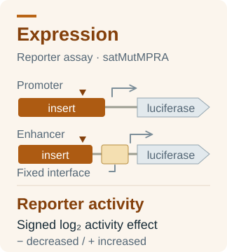
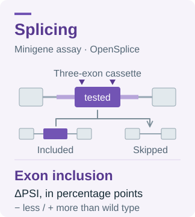

# Tasks

VEP-bench publishes transparent development tasks with exact model prompts, complete responses, and deterministic scores.

## Fitness (SGE)

Predict continuous functional effects for panels sampled from endogenous-locus saturation genome editing assays.

- One eligible exon-level question per gene with 50 complete assayed alleles
- Gene, assay mechanism, and exon sequence with exact 100 bp flanks
- Mean within-gene Spearman correlation, with Pearson and output-validity diagnostics
- Source: published SGE score sets in [MaveDB](https://www.mavedb.org/), cited as [Rubin et al. (2025)](https://doi.org/10.1186/s13059-025-03476-y)

[Open task →](./tasks/sge.html)

## Expression (satMutMPRA)

Predict signed reporter-activity effects for panels sampled across the measured effect distribution of 16 regulatory elements.

- 16 element-level questions with 50 variants each
- Full assayed element sequence, assay context, and compact VCF input
- Mean within-element Spearman correlation, with Pearson and output-validity diagnostics
- Source: [Kircher et al. (2019)](https://doi.org/10.1038/s41467-019-11526-w), distributed in the [CADD v1.7 RegSeq collection](https://kircherlab.bihealth.org/download/CADD-development/v1.7/validation/regseq/)

[Open task →](./tasks/satmut-mpra.html)

## Splicing (OpenSplice)

Predict signed changes in exon inclusion for score-space-sampled allele panels in
complete source-derived three-exon minigene cassettes.

- 20 exon-level questions from 20 distinct genes, with 50 complete alleles each
- Complete cassette sequence, exact segment intervals, and HEK293T assay context
- Mean within-exon Spearman correlation, with Pearson and output-validity diagnostics
- Source: [Quarantani et al. (2026)](https://doi.org/10.64898/2026.05.22.727141) and the [OpenSplice Figshare v5 dataset](https://doi.org/10.6084/m9.figshare.32337414.v5)

[Open task →](./tasks/opensplice-snv.html)

